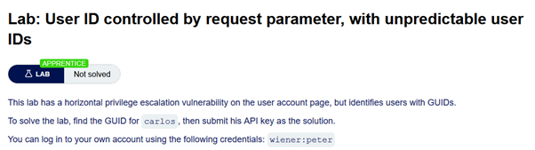
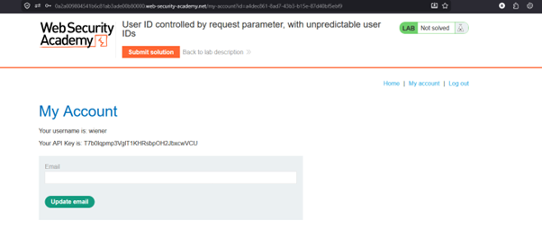
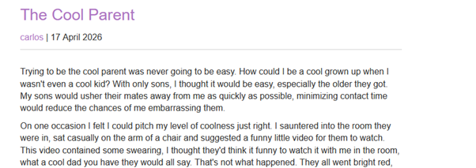
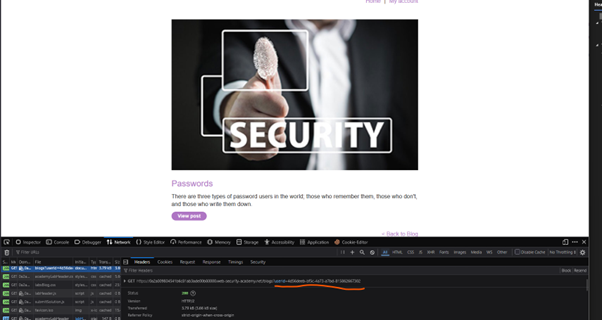
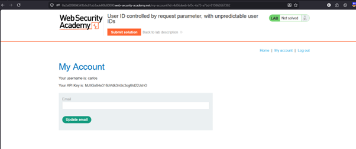
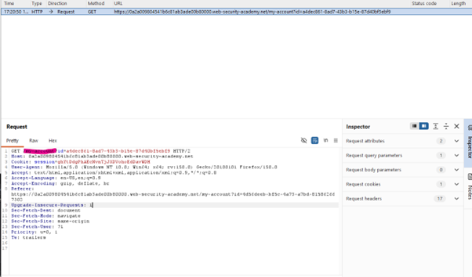

# Access Control - Horizontal Privelege Escelation (IDOR)

## 🔹 Overview

This lab demonstrates a **Horizontal Privilege Escalation (IDOR)** vulnerability, where user-controlled identifiers can be modified to access other users’ data.

Spec:



Environment after log in:



---

## 🔹 Vulnerability

The application uses a user-controlled `id` parameter to access account data:

```http
/my-account?id=<UUID>
```

This suggests that the application uses user-controlled identifiers to retrieve account data without verifying ownership.

## 🔹 Exploitation

### Step 1 - Observe normal behaviour

After logging in with the spec provided credentials the account ID was:

```http
a4dec861-8ad7-43b3-b15e-87d40bf5ebf9
```

Since the ID is in UUID format, sequential brute-force attacks are impractical, requiring alternative methods to discover valid identifiers.

---

### Step 2 - Identify other user IDs

The main page was populated with multiple blog posts:


The above picture was a blog written by our target Carlos:



Clicking on the username triggered a request containing Carlos's UUID, which was visible in the browser DevTools network tab.



---

### Step 3 - Modify request

By replacing the `id` parameter with Carlos's UUID:

```http
/my-account?id=<carlos-uuid>
```

Result:

- Access to Carlos’s account data
- Verified horizontal privilege escalation



---

### Step 4 - Reproduce in Burp

1. Capture account request
2. Send to Repeater
3. Modify id parameter
4. Retrieve another user’s data



---

## 🔹 Impact

This vulnerability allows:

- Access to other users’ sensitive data
- Bypassing access controls
- Potential account takeover or data exposure

This is a classic Insecure Direct Object Reference (IDOR) caused by missing server-side authorization checks.

---

## 🔹 Root Cause

- User-controlled identifier (id) is trusted
- No server-side access control check
- Authentication exists, but authorization is missing

This represents a failure of access control enforcement, the application does not verify that the authenticated user owns the requested resource.

---

## 🔹 Mitigation

Access control must be enforced server-side for every request.

### Enforce access control checks

Ensure the requested resource belongs to the authenticated user.

```python
if request.user.id != requested_id:
    deny_access()
```

### Avoid exposing direct identifiers

Use indirect references or mapped IDs where possible.

### Validate ownership server-side

Never rely on client-side checks or hidden fields.

### Apply least privilege

Limit data returned to only what the user is authorised to access.

## 🔹 Key Learning

User input should never determine access to resources without strict server-side authorization checks.
