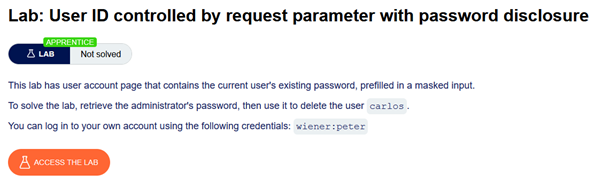
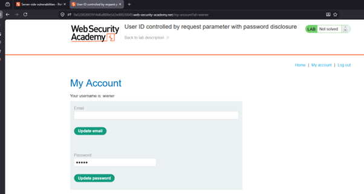
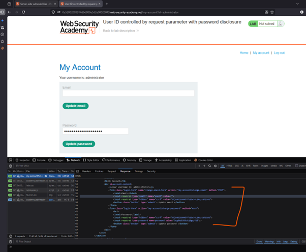
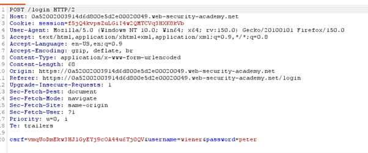
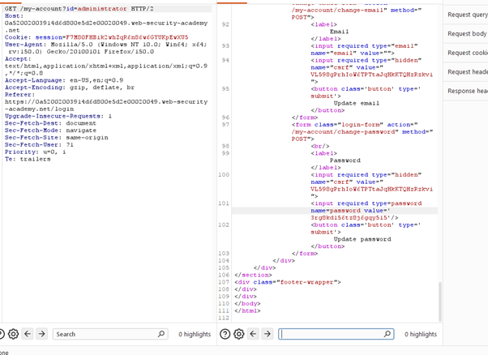

# Access Control - Horizontal to Vertical Privelege Escelation

## 🔹 Overview

This lab demonstrates a **Horizontal to Vertical Privilege Escalation** vulnerability, where an attacker first accesses another user’s data (horizontal), then leverages additional sensitive information to gain higher privileges (vertical).

Spec:



Environment after logging in:



---

## 🔹 Vulnerability

The application allows users to search for other accounts using a query parameter:

```http
/my-account?id=<username>
```

This indicates that user-controlled input is used to retrieve account data without enforcing proper access control checks.

## 🔹 Exploitation

### Step 1 - Identify other users

Based on the lab description, the vulnerability was expected to involve request manipulation, so these were monitored using the browser DevTools.
The `username` parameter was modified from `wiener` to `admin`, then `administrator`, using arbitrary passwords.



The response revealed:

- Username: administrator
- Password: 3rg8kd156tz8j6gqy515

This demonstrates that the application exposes sensitive credentials in responses when accessing other users’ data.

### Step 2 - Privilege escalation

Using the retrieved credentials:

- Logged in as administrator
- Gained access to higher privileged functionality

This confirms vertical privilege escalation.

### Step 3 - Reproduce in Burp

1. Log in as a normal user (wiener)
2. Capture request in Proxy
3. Send to Repeater



4. Modify username parameter
5. Observe response revealing sensitive data



---

## 🔹 Impact

This vulnerability allows:

- Access to other users’ sensitive information
- Disclosure of credentials
- Privilege escalation to administrator

This combines horizontal access control bypass with credential disclosure, resulting in full privilege escalation.

---

## 🔹 Root Cause

- User-controlled identifiers are trusted
- No authorization check is performed on requested resources
- Sensitive data (passwords) is exposed in responses

This is an IDOR vulnerability combined with sensitive data exposure, enabling escalation from horizontal to vertical access.

---

## 🔹 Mitigation

Authorization must be enforced independently of user-controlled input.

### Enforce access control checks

Ensure the requested resource belongs to the authenticated user.

```python
if request.user.id != requested_id:
    deny_access()
```

### Never expose sensitive data

Passwords and credentials must never be returned in responses.

### Use secure storage for credentials

Store passwords as hashed values and never expose them via APIs.

### Apply least privilege

Restrict access to sensitive functionality based on role.

---

## 🔹 Key Learning

User-controlled input combined with sensitive data exposure can escalate a simple access control flaw into full privilege compromise.
