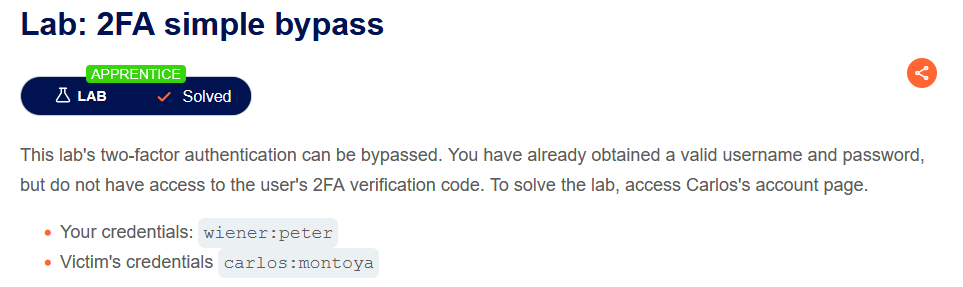
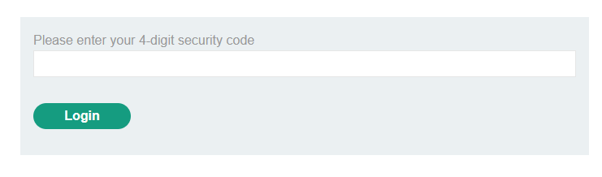
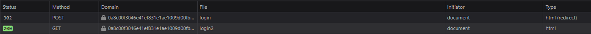
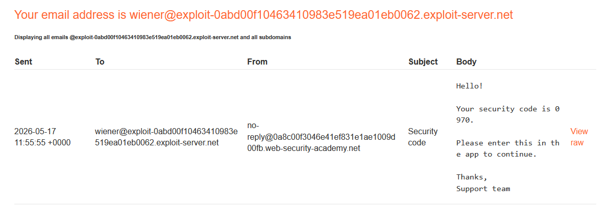
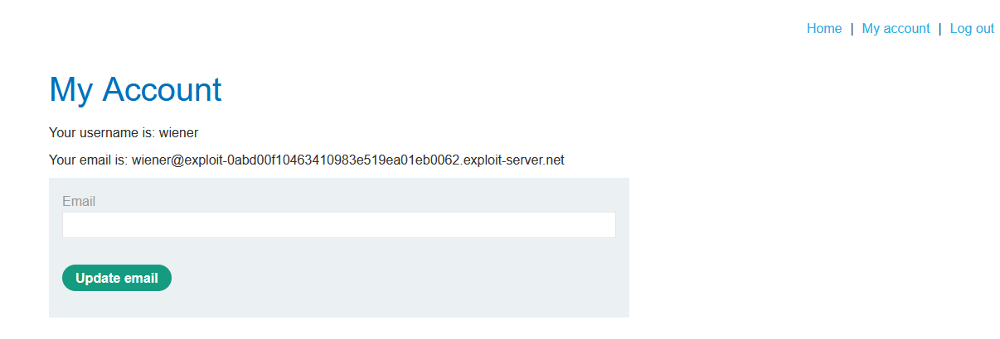
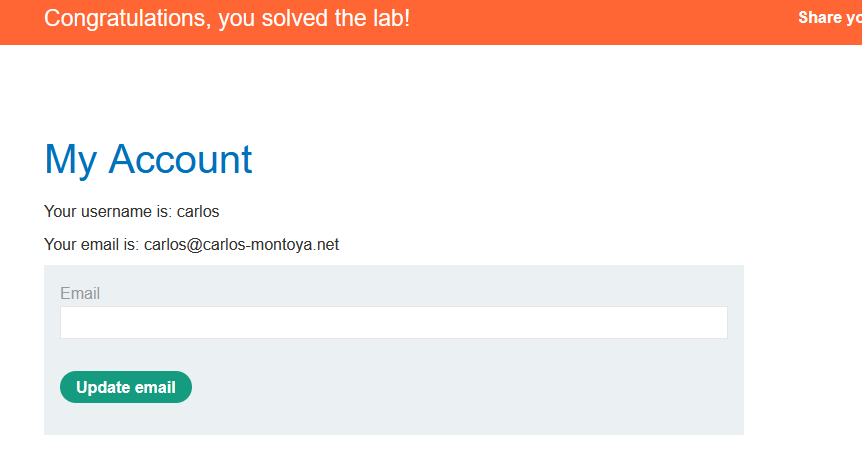

# Authentication - 2FA Bypass

## 🔹 Overview

This lab demonstrates a **flawed two-factor authentication (2FA) implementation**, where authentication steps are not properly enforced, allowing attackers to bypass MFA entirely.

Spec:



Environment after log in:



---

## 🔹 Vulnerability

The application implements a two-step login process:

1. POST `/login` (username + password)
2. GET `/login2` (MFA verification)

This indicates that the application separates authentication into multiple steps but does not properly enforce the completion of all steps before granting access, leaving the user in a ‘logged-in’ state without MFA.

---

## 🔹 Exploitation

### Step 1 - Observe authentication flow

After logging in with valid credentials, the application:

- Sends a POST request to `/login`
- Responds with a `302` redirect to `/login2`



---

### Step 2 - Analyse MFA behaviour

The MFA code is retrieved via an email client endpoint:



This indicates that MFA is handled as a separate request rather than tightly bound to the authentication session.

---

### Step 3 - Identify bypass

Instead of completing the MFA step:

- Log in with valid credentials
- Interrupt the authentication flow by navigating away (e.g. “Back to lab home”)
- Access the account page directly



Result:

- Access granted without completing MFA

---

### Step 4 - Exploit for another user

Using another account (Carlos):

- Log in using known credentials
- Skip MFA step using the same method



### Step 5 - Alternative method (direct URL manipulation)

Instead of completing the MFA step at:

```http
/login2
```

With:

```http
/my-account?id=carlos
```

---

## 🔹 Impact

This vulnerability allows:

- Bypass of multi-factor authentication
- Full account access with only username and password
- Unauthorized access to sensitive user accounts

This reduces the authentication process to a single factor, defeating the purpose of 2FA.

---

## 🔹 Root Cause

- Authentication state is established before MFA completion
- No server-side enforcement of MFA step completion
- Sensitive endpoints do not verify MFA status

This is a logical flaw in authentication flow, where users are treated as fully authenticated before completing all required steps.

---

## 🔹 Mitigation

Authentication should only be considered complete once all required steps, including MFA, have been verified server-side.

### Enforce authentication state after MFA

Ensure users are not granted access until MFA is completed

```python
if not session.mfa_verified:
    redirect("/login2")
```

### Bind MFA to session securely

Mark sessions as fully authenticated only after MFA:

```python
if session.mfa_verified:
    session.authenticated = True
```

### Protect sensitive endpoints

All protected routes must verify full authentication:

```python
if not session.authenticated:
    deny_access()
```

### Avoid relying on redirects alone

Security must not depend on client-side navigation flow.

---

## 🔹 Key Learning

Authentication flows must enforce every step server-side; otherwise, multi-factor authentication can be bypassed entirely.
