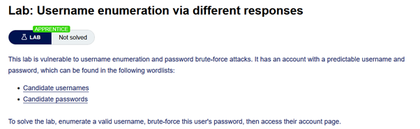
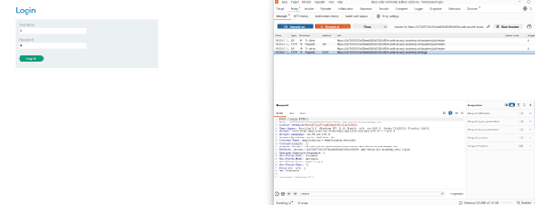
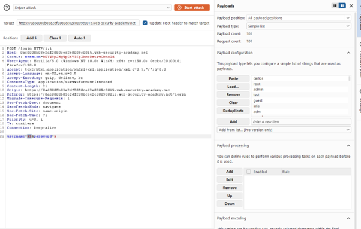
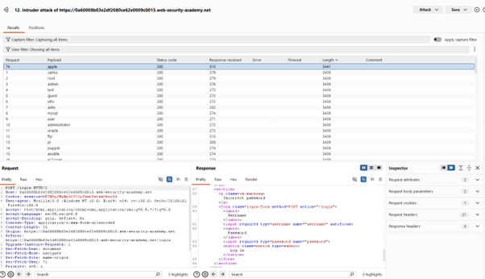
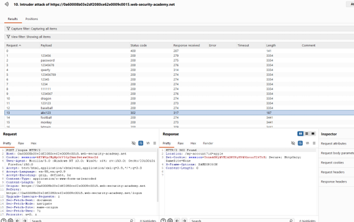
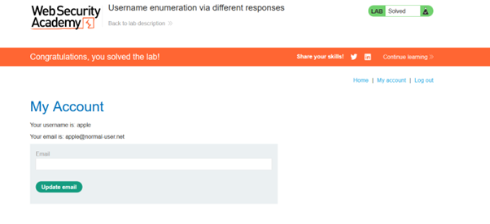

# Username Enumeration via Different Responses

## 🔹 Overview

This lab demonstrates a **Username Enumeration vulnerability**, where differences in application responses reveal whether a username is valid.

Spec:



---

## 🔹 Vulnerability

The application provides different responses depending on whether the username exists:

- Invalid username returns `"Invalid user"`
- Valid username + wrong password returns `"Incorrect password"`

This indicates that authentication responses leak information by behaving differently depending on whether a username is valid.

---

## 🔹 Exploitation

### Step 1 - Capture request

A login request was captured and sent to Burp Intruder:

```http
POST /login
```



---

### Step 2 - Enumerate usernames

A sniper attack was configured on the username field using a provided wordlist.



Key observation:

- Responses with length 3439 contains `"Invalid user"`
- Responses with length 3441 contains `"Incorrect password"`

This difference indicates valid usernames.



From the results, `apple` was identified as a valid username because it produced the `"Incorrect password"` response.

---

### Step 3 - Brute-force password

A second Intruder attack was configured:

Username fixed as apple
Password field set as payload for a new sniper attack with the provided password wordlist.



A single response returned a 302 redirect, indicating a successful login (as the application redirects authenticated users).

---

### Step 4 - Verify login

Using:

```http
user = apple
password = abc123
```



Successfully logged in to the account.

---

## 🔹 Impact

This vulnerability allows:

- Identification of valid usernames
- Reduction of brute-force attack complexity
- Increased likelihood of account compromise

Username enumeration significantly lowers the effort required to successfully brute-force authentication by creating a side-channel that reveals valid usernames.

---

## 🔹 Root Cause

- Application returns distinct responses for different authentication failures
- Behavioural differences reveal account validity
- No attempt to standardise error messages

This is an information disclosure vulnerability caused by inconsistent authentication responses.

---

## 🔹 Mitigation

Authentication responses must not reveal whether a username is valid.

### Use generic error messages

Return the same response for all authentication failures:

```python
return "Invalid username or password"
```

### Standardise response behaviour

Ensure responses are identical in:

- Message content
- Status codes
- Response length

### Implement rate limiting

Limit repeated login attempts.

### Account lockout policies

Lock accounts after multiple failed attempts.

---

## 🔹 Key Learning

Differences in application behaviour can create side-channels that leak sensitive information; authentication responses must be consistent to prevent enumeration.
