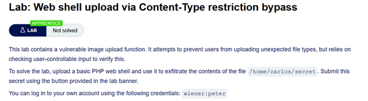
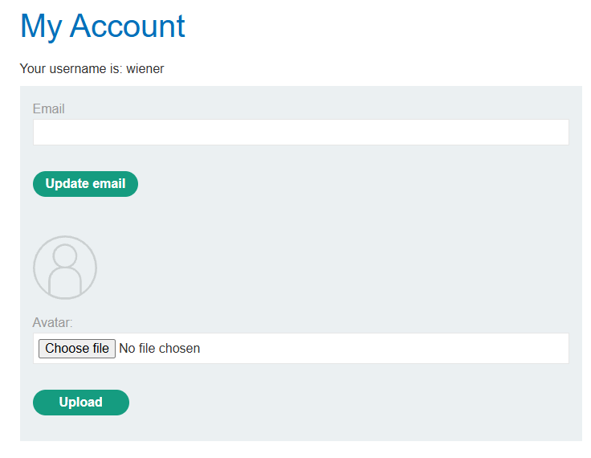
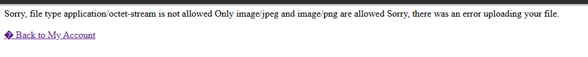
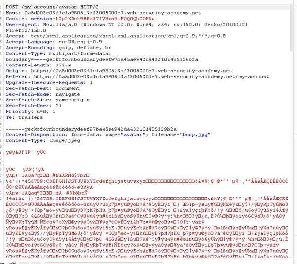
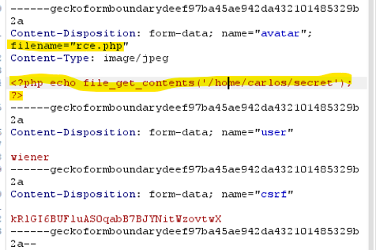
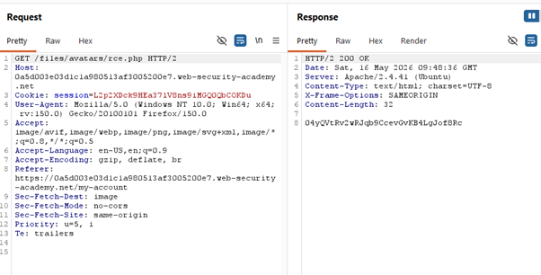
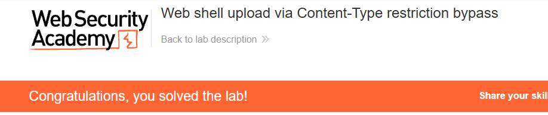

# Lab: File Upload → RCE via Content‑Type Bypass

## 🔹 Overview

This lab demonstrates a **File Upload vulnerability with flawed validation**, where restrictions based on user-controlled metadata (e.g. Content-Type headers) can be bypassed, resulting in Remote Code Execution (RCE).

Spec:



---

Environment after logged in with provided details:



## 🔹 Vulnerability

The application attempts to restrict file uploads by checking:

- File extension
- Content-Type header

This indicates that validation relies on user-controlled metadata rather than verifying the actual file content.

---

## 🔹 Exploitation

### Step 1 - Identify upload restriction

The application prevents direct upload of `.php` files via the UI.



However, this validation occurs on the client side or relies on request metadata.

---

### Step 2 - Upload a valid JPEG and intercept the request

The upload request was intercepted using Burp Proxy.



This allowed modification of the request before it reached the server.

---

### Step 3 - Craft malicious payload

A PHP payload was embedded into the uploaded file:

```php
<?php echo file_get_contents('/home/carlos/secret'); ?>
```

This payload directly targets the sensitive file provided in the lab.
This works because the server executes uploaded `.php` files, allowing embedded code to run when accessed.

---

### Step 4 - Bypass Content-Type validation

The request was modified:

- Changed `filename` to `rce.php`
- Replaced the file contents with PHP code
- Set `Content-Type: image/jpeg` in the request



This worked because:

- The server trusted the Content-Type was still `image/jpeg`
- The header is user-controlled and easily modified

---

### Step 5 - Upload and execute file

After upload, the file was accessible:

```http
[base_url]/files/avatars/rce.php
```



Result:

- PHP code executed on the server
- Sensitive data retrieved

### Step 6 - Confirm exploitation

The secret was successfully retrieved and submitted.



---

## 🔹 Impact

This vulnerability allows:

- Bypassing file upload restrictions
- Execution of arbitrary code
- Access to sensitive files and system data

Weak validation mechanisms can be bypassed, leading to full server compromise.

---

## 🔹 Root Cause

- Validation relies on user-controlled metadata (Content-Type, filename, request body)
- No verification of actual file content
- Uploaded files are executed by the server

This demonstrates how relying on client-controlled data creates a false sense of security.

---

## 🔹 Mitigation

File validation must be based on trusted data, not user input.

### Do not trust Content-Type

Treat headers as user-controlled and unreliable.

### Validate file content

Verify uploaded files using magic bytes rather than file extensions or headers. Image files typically begin with consistent byte signatures (magic bytes) that uniquely identify their format.

```python
def is_jpeg(file_bytes):
    return file_bytes.startswith(b'\xFF\xD8\xFF')

if not is_jpeg(file.read(3)):
    return invalid_file()
```

This verifies the file based on its actual binary content (JPEG example), rather than relying on user-controlled metadata.

### Restrict file execution

Ensure uploaded files cannot be executed as code.

### Store files securely

Store uploads outside the web root and serve them safely.

---

## 🔹 Key Learning

Security controls based only on user-controlled metadata can be bypassed. Proper validation must verify actual file content and enforce strict execution controls
