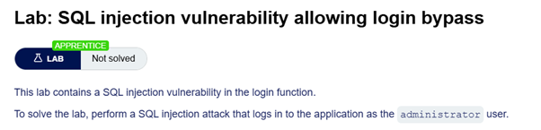
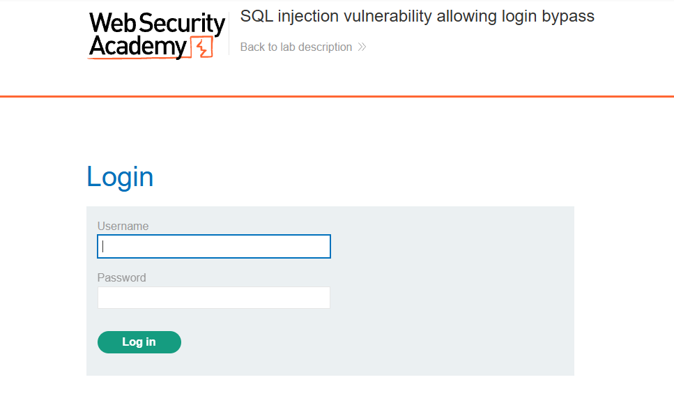

# Lab: SQL Injection → Login Bypass

## 🔹 Overview

This lab demonstrates a **SQL Injection vulnerability**, where user input in a login form is used to bypass authentication controls.

Spec:



---

## 🔹 Vulnerability

The application authenticates users via a login form:

```http
POST /login
```

This suggests that user input is likely used to construct a database query.

## 🔹 Exploitation

### Step 1 - Identify injection point

The login form contains:

- username
- password



These fields are likely used in a query such as:

```SQL
SELECT * FROM users
WHERE username = '<input>'
AND password = '<input>';
```

---

### Step 2 - Test for SQLi and assess response

Adding a `'` in the `username` field with an arbitrary password triggered an error:


This indicates that the input is likely being interpreted as part of a SQL query, and that improper escaping of user input is occurring.

---

### Step 3 - Inject SQL payload (spec given username)

The username field was modified:

```http
username=administrator'--
password=anything
```

Explanation:

- `'` -> closes the username string
- `--` -> comments out the rest of the query

This causes the query to be reduced to:

```SQL
SELECT * FROM users
WHERE username = 'administrator';
```

Result:

- Password check is bypassed
- Authentication succeeds as administrator


This removes the password condition from the query entirely, effectively bypassing authentication.

---

## 🔹 Impact

This vulnerability allows:

- Authentication bypass
- Unauthorized access to privileged accounts
- Potential full system compromise

SQL injection can allow attackers to bypass authentication entirely by modifying query logic.

---

## 🔹 Root Cause

- User input is directly concatenated into SQL queries
- No separation between query logic and user data
- No parameterisation or input validation

This allows attackers to manipulate authentication logic.

---

## 🔹 Mitigation

Authentication queries must treat user input as data, not code.

### Use parameterised queries

```python
query = "SELECT * FROM users WHERE username = ? AND password = ?"
cursor.execute(query, (username, password))
```

### Avoid string concatenation

Do not construct queries like:

```SQL
SELECT * FROM users WHERE username = '" + username + "' AND password = '" + password + "'
```

### Use secure password handling

Store passwords using hashing and verify using secure comparison.

### Implement account protections

Use rate limiting and account lockout mechanisms.

---

## 🔹 Key Learning

SQL injection can bypass authentication by modifying query logic. Proper separation of user input and query execution is essential to prevent attackers from gaining unauthorized access.

It is worth noting that the application implements a good defensive measure by using a generic error message:

```
Invalid username or password.
```


This prevents attackers from distinguishing whether the username or password was incorrect, reducing the risk of username enumeration.
