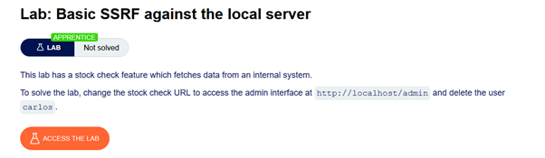
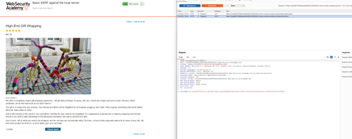
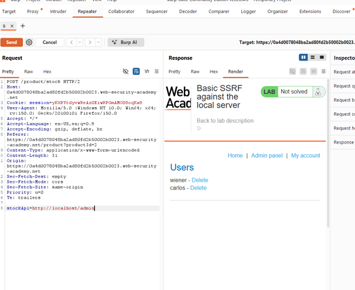
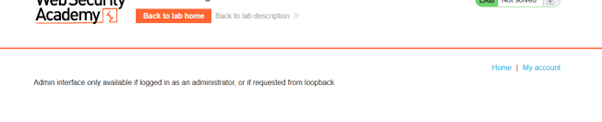
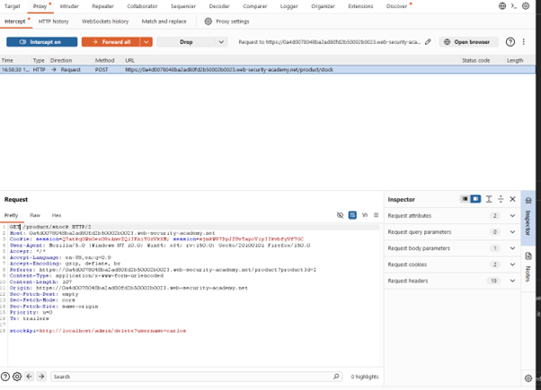
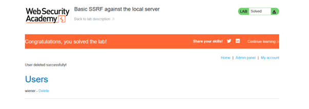

# Basic SSRF against the Local Server

## 🔹 Overview

This lab demonstrates a **Server-Side Request Forgery (SSRF)** vulnerability, where user-controlled input is used to make requests from the server to internal resources.

Spec:



---

## 🔹 Vulnerability

The application checks product stock using a server-side API:

```http
POST /product/stock
```

The request includes a parameter such as:

```http
stockApi=http://…
```

This indicates that the application uses user-controlled input to determine the destination of a server-side request.

---

## 🔹 Exploitation

### Step 1 - Identify SSRF sink

The “Check stock” functionality sends a request to a backend API.



This suggests that the `stockApi` parameter controls the destination of a server-side request.

---

### Step 2 - Target internal service

The parameter was modified to point to an internal admin interface:

```http
stockApi=http://localhost/admin
```

This targets an internal service that is not directly accessible from the user's browser.

Alternatively, internal addresses such as `127.0.0.1` could be tested to identify accessible internal services if the correct endpoint was not provided.



Result:

- Access to the internal admin page
- Confirmed SSRF to localhost

---

### Step 3 - Perform privileged action

From the admin interface, an attempt to delete the user carlos returned an error.



---

### Step 4 - Analyse and modify request

When placing the cursor on `carlos - Delete` the complete URL was displayed in the browser:

```http
/delete?username=carlos
```

The delete request was adjusted:

- Appended the query parameter to form:

```http
stockApi=http://localhost/admin/delete?username=carlos
```

- The request method was changed from `POST` to `GET`, as the endpoint accepted GET requests for this action.
- Note `POST` worked aswell with a second attempt. However, for correctness I wanted to match a true delete request.



---

### Step 5 - Verify exploitation

After repeating the request and reopening the admin page:

- User `carlos` was successfully deleted



---

## 🔹 Impact

This vulnerability allows:

- Access to internal services
- Bypassing access control mechanisms
- Performing privileged actions (e.g. deleting users)

SSRF enables attackers to interact with internal systems that are not directly accessible externally.

---

## 🔹 Root Cause

- User-controlled input (stockApi) is used to construct server-side requests
- No validation or restriction on target URLs
- Trust is placed in internal requests

The application implicitly trusts requests originating from localhost, assuming they are safe which enables attackers to pivot from external input to internal system interaction.

---

## 🔹 Mitigation

Untrusted input should never be used directly in server-side requests.

### Restrict outbound requests

Only allow requests to trusted, predefined domains (allow-list).

```python
if url not in allowed_hosts:
    reject_request()
```

### Block internal address access

Prevent access to:

- 127.0.0.1
- localhost
- internal IP ranges

### Use allow-list validation

Only allow expected endpoints rather than arbitrary URLs.

### Network-level controls

Restrict server access to internal services via firewall rules.

---

## 🔹 Key Learning

SSRF is fundamentally a trust boundary failure where user input enables interaction with internal systems that should not be externally accessible.
