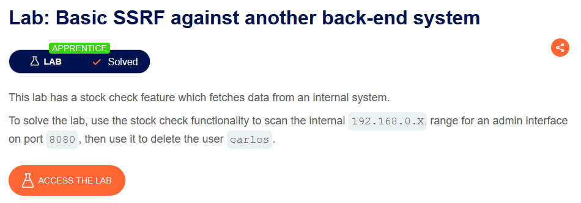
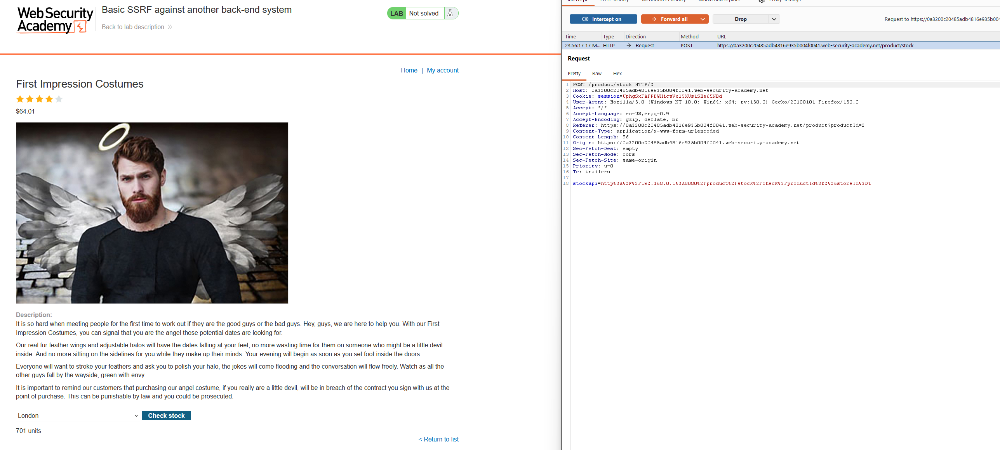
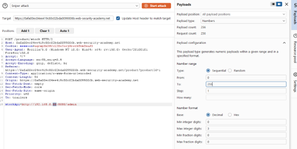
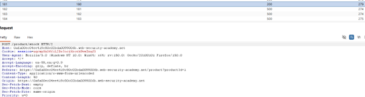
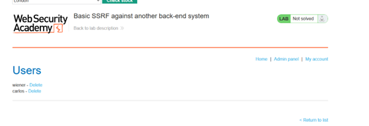
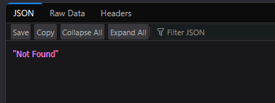
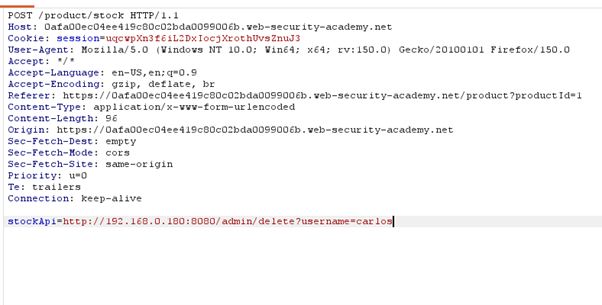
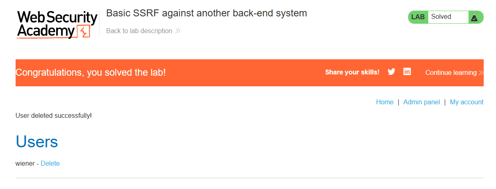

# Basic SSRF against Another Back-end System

## 🔹 Overview

This lab demonstrates a **Server-Side Request Forgery (SSRF)** vulnerability used to discover and interact with internal back-end systems by enumerating internal IP addresses.

Spec:



---

## 🔹 Vulnerability

The application uses a parameter to fetch stock data:

```http
POST /product/stock
```

With input:

```http
stockApi=http://<IP>:<PORT>/...
```

This indicates that the `stockApi` parameter controls the destination of a server-side request and can be manipulated to target internal resour

---

## 🔹 Exploitation

### Step 1 - Identify SSRF sink

The stock check functionality sends a request to a backend API.



---

### Step 2 - Enumerate internal network

A payload was constructed to target internal IP ranges:

```http
http://192.168.0.X:8080/admin
```

To find a valid host, the final octet (X) was brute-forced (0-255) using Burp Intruder.



---

### Step 3 - Identify live host

A `200 OK` response was observed for:

```http
192.168.0.180
```



This indicates that a live internal service is running at that address.

---

### Step 4 - Access internal admin panel

Using the discovered host:

```http
http://192.168.0.180:8080/admin
```



Result:

- Access to internal administrative interface
- Confirmed SSRF to internal network

This confirms that the server can communicate with internal systems not accessible externally.

---

### Step 5 - Perform privileged action

Attempting to delete `carlos` from the admin panel resulted in an error.



---

### Step 6 - Modify request

The delete endpoint was adjusted directly via the SSRF payload:

```http
http://192.168.0.180:8080/admin/delete?username=carlos
```

This works because SSRF allows direct interaction with internal endpoints.



---

### Step 7 - Verify exploitation

After reloading the admin panel:

- User carlos was successfully deleted



---

## 🔹 Impact

This vulnerability allows:

- Discovery of internal systems
- Access to internal admin interfaces
- Execution of privileged actions

SSRF enables attackers not only to access internal resources, but also to enumerate and map internal networks.

---

## 🔹 Root Cause

- User input is used to construct server-side requests
- No validation or restriction on internal network access
- Internal services trust requests originating from the server

This is a trust boundary failure where user input enables interaction with internal infrastructure that should not be externally accessible. This allows attackers to pivot from external input into internal network discovery and exploitation.

---

## 🔹 Mitigation

Untrusted input must not control server-side request destinations.

### Restrict outbound requests

Only allow expected endpoints (allow-list validation).

```python
if url not in allowed_hosts:
    reject_request()
```

### Block internal network access

Prevent access to:

- Private IP ranges (e.g. 192.168.0.0/16)
- 127.0.0.1, localhost

### Validate and normalise URLs

Ensure user input cannot target arbitrary hosts.

### Network-level protections

Use firewalls or network segmentation to restrict internal service exposure.

---

## 🔹 Key Learning

SSRF can be used for internal network enumeration, enabling attackers to discover and interact with back-end systems that are otherwise inaccessible.
