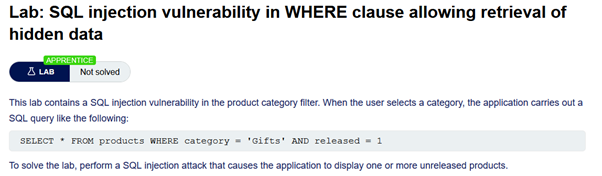
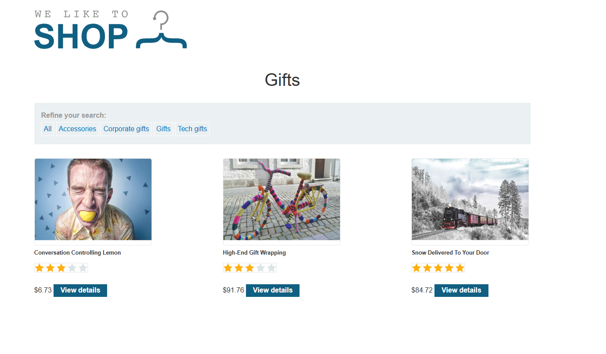
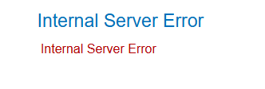
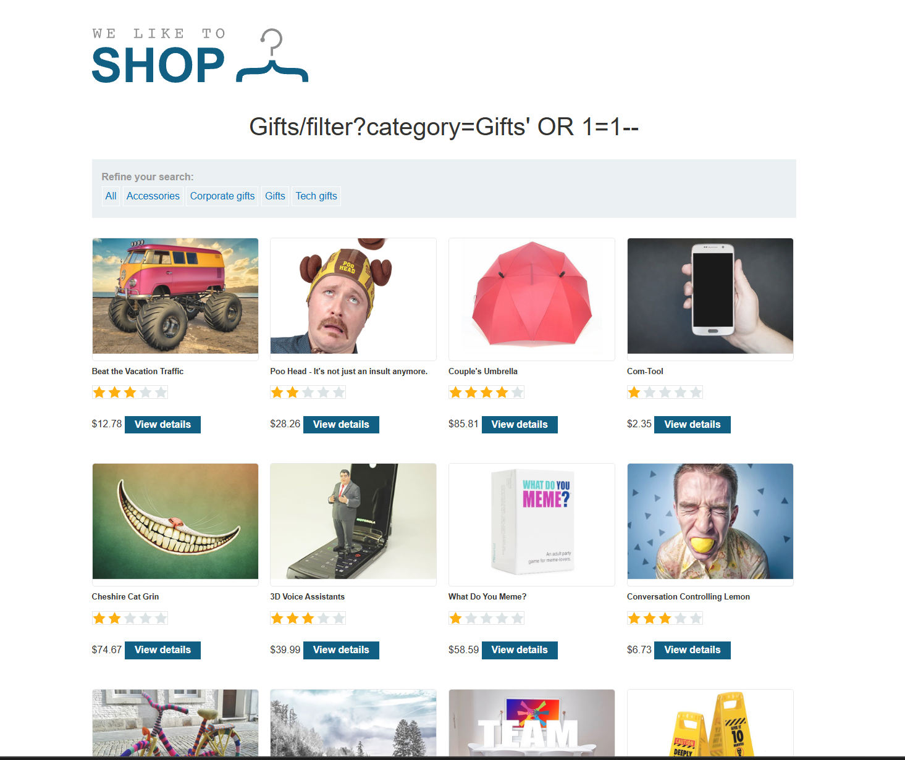

# SQL Injection - Data Exfiltration

## 🔹 Overview

This lab demonstrates a **SQL Injection vulnerability**, where user input is inserted into a database query, allowing attackers to retrieve hidden data.

Spec:



---

Base URL:

```http
https://0a5800b004d6892484c669af008d0047.web-security-academy.net/
```

Home page:


## 🔹 Vulnerability

The application filters products by category using a query such as:

```http
/filter?category=Clothing, shoes and accessories
```

This suggests that user input is used directly in a SQL query.

## 🔹 Exploitation

### Step 1 - Observe normal behaviour

Selecting a `Gifts` returns only visible, released products



But this also gave us an injection point

```http
/filter?category=Gifts
```

This was due to the fact that the query looked something like:

```SQL
SELECT * FROM products
WHERE category = 'Gifts'
AND released = 1;
```

Explanation:

- **SELECT \*** -> selects all columns
- **FROM products** -> from the `products` table
- **WHERE category = 'Gifts'** -> filters by category
- **AND released = 1** -> only returns visible (released) products

---

### Step 2 - Test for SQLi and assess response

Adding a `'` to the injection point returned



This indicates that the input is likely being interpreted as part of a SQL query, and that improper escaping of user input is occurring.

### Step 3 - Inject SQL payload

The category parameter was modified:

```http
/filter?category=Gifts'+OR+1=1--
```

Explanation:

- `+` is a URL encoded space character
- `OR 1=1` is a condition that is always true
- `--` comments out the remainder of the SQL query
- The use of `--` indicates a SQL comment syntax, confirming that the backend is likely using a SQL-based database.

This injection creates:

```SQL
SELECT * FROM products
WHERE category = 'Gifts' OR 1=1--
AND released = 1;

```

Since `OR 1=1` is always true, the WHERE condition is effectively bypassed. This effectively turns the query into:

```SQL
SELECT * FROM products;
```

Result:

- All products returned
- Hidden and unreleased items exposed



## 🔹 Impact

This vulnerability allows:

- Retrieval of hidden or restricted data
- Bypassing application logic
- Exposure of sensitive database content

SQL injection can allow attackers to exfiltrate arbitrary data from the database, including hidden, restricted, or sensitive records.

---

## 🔹 Root Cause

- User input is directly concatenated into SQL queries
- No separation between data and query logic
- No input sanitisation or parameterisation

This allows attackers to manipulate query logic and bypass application-level restrictions.

---

## 🔹 Mitigation

User input must never be directly included in SQL queries.

### Use parameterised queries

Ensure input is treated as data:

```python
query = "SELECT * FROM products WHERE category = ?"
cursor.execute(query, (user_input,))
```

This uses a parameterised query, where the `?` placeholder is safely replaced with user input. This ensures the input is treated as data rather than executable SQL, preventing injection attacks.

### Avoid string concatenation

Do not construct queries like:

```SQL
SELECT * FROM products WHERE category = '" + user_input + "'
```

### Validate input

Restrict input to expected values:

```python
valid_categories = ["All", "Accessories", "Corporate gifts", "Gifts", "Tech gifts"]
if user_input not in valid_categories:
    invalid_input()

```

### Apply least privilege

Limit database permissions to reduce impact of compromise.

---

## 🔹 Key Learning

SQL injection occurs when user input is treated as part of a query rather than as data, allowing attackers to manipulate query logic and retrieve unintended results. This demonstrates how small changes in input can significantly alter backend query behaviour.
